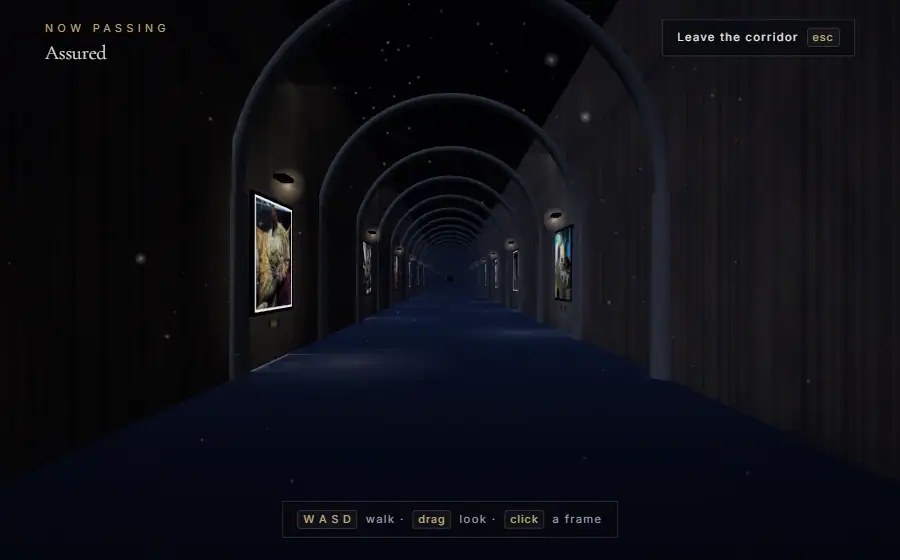
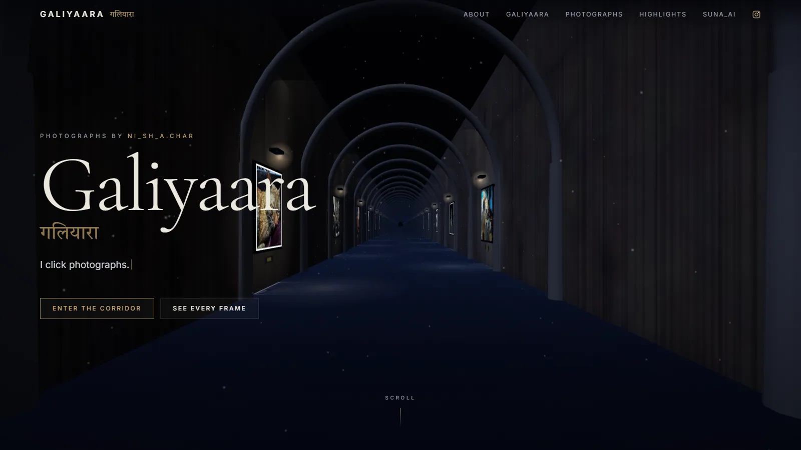
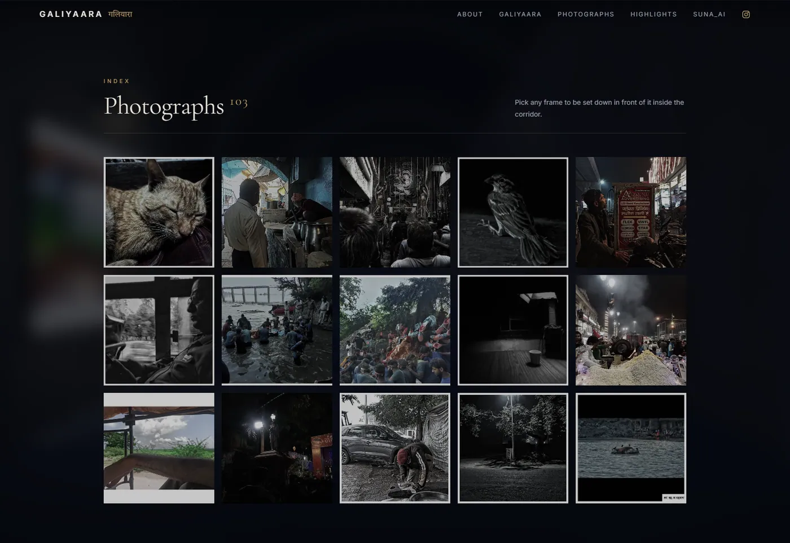
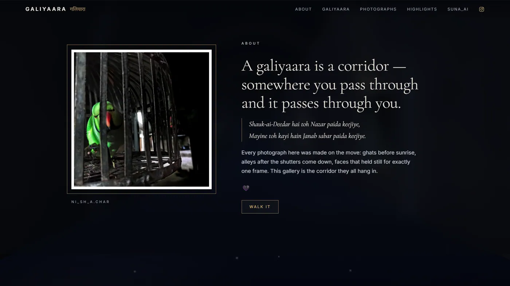

<div align="center">

# Galiyaara · गलियारा

**A photography portfolio you walk through instead of scroll.**

*Galiyaara* means corridor. So the site is one — a moonlit stone arcade rendered live in
your browser, with the photographs hung between the arches. No embed, no gallery service,
no build framework. Drop a photo in a folder, push, and it is on the wall.

[**→ Walk it**](https://ni-sh-a-char.github.io/Galiyaara/) &nbsp;·&nbsp;
[Photographs by ni_sh_a.char](https://www.instagram.com/ni_sh_a.char/)

[](https://github.com/ni-sh-a-char/Galiyaara/actions/workflows/deploy.yml)
[](LICENSE)
[](photos/LICENSE)
[](https://threejs.org)




</div>

---

## What this is

Most photography sites are a grid. This one is a place. You arrive at the mouth of an
arcade at night, the corridor runs off into fog, and every photograph is lit where it hangs.
You can scroll past it like a normal page, or step inside and walk.

<table>
<tr>
<td width="50%"></td>
<td width="50%"></td>
</tr>
<tr>
<td><b>Arrive.</b> Scroll pulls the camera down the corridor while the page reads over it.</td>
<td><b>Step up to a frame.</b> Click one and the camera docks; the full-resolution file loads.</td>
</tr>
<tr>
<td></td>
<td></td>
</tr>
<tr>
<td><b>Or take the index.</b> Every frame, keyboard-navigable. Click one to be set down in front of it inside the corridor.</td>
<td><b>Reads as a site, too.</b> The 3D never gets in the way of the words.</td>
</tr>
</table>

**Controls** — `W` `A` `S` `D` walk · drag to look · click a frame · `←` `→` next/previous ·
`space` pause a walk · `esc` step back · double-click for pointer lock · thumbstick on touch.

Or don't steer at all: **take a curated walk** and the corridor moves you frame to frame
along a route, holding in front of each photograph long enough to actually look at it. The
walks, and the order everything hangs in, are written by a free AI model at build time — see
[The curator](#the-curator).

---

## Add a photograph

Put the file in [`photos/`](photos/) and push. That is the whole procedure.

```bash
cp ~/Pictures/new-shot.jpg photos/
git add photos/ && git commit -m "add new-shot" && git push
```

A minute later GitHub Actions has resized it, measured it, sampled its colour, **had a model
look at it and write its title, caption, alt text and tags**, worked out where in the show it
belongs, hung it and redeployed. **Nothing in the code mentions any individual photograph.**
Deleting one works the same way — remove the file and push.

**You always get the last word.** Anything you write in
[`photos/captions.json`](photos/captions.json) beats what the model wrote, field by field, and if
there is no curation at all the title falls back to the filename — `night flower.jpg` becomes
*Night Flower*.

```json
{
  "night flower.jpg": "Raat Ki Rani",
  "banars.jpg": { "title": "Banaras", "caption": "Older than history." }
}
```

Accepted: `.jpg` `.jpeg` `.png` `.webp` `.avif` `.tif` `.tiff`. Upload the biggest version you
have — the build makes its own web-sized copies and never ships the original.

---

## Make it yours

The corridor is not tied to these photographs, or to this photographer. To run it with your own:

1. **Fork**, then empty [`photos/`](photos/) and drop yours in. Delete `photos/captions.json`
   if you would rather every title came from the filename.
2. **Replace** `public/assets/portrait.jpg` with your own portrait.
3. **Optional: add a free AI key** as a secret so your photographs get written up too.
   Skip it and everything still works, just with filename titles. See
   [The curator](#the-curator).
4. **Edit `public/index.html`** — it is a single hand-authored file, and every piece of you in
   it is in plain sight: `<title>`, the `og:` meta tags, the nav links, the hero, the About
   copy, the Instagram links, the footer. Search for `ni_sh_a.char` and you will find them all.
5. **Update the licences.** [`photos/LICENSE`](photos/LICENSE) reserves *these* photographs;
   put your own terms there. `LICENSE` (MIT) covers the code and you can keep it as is.
6. **Settings → Pages → Source → GitHub Actions.** Push, and you are live.

Everything else — corridor length, layout, colour, streaming — derives from your photographs
automatically. If you build one, open an issue; a wall of forks is the best thing that could
happen to this repo.

---

## How it works

Three moving parts, none of them a framework.

### 1. The build turns a folder into a manifest

[`tools/build.mjs`](tools/build.mjs) copies `public/` verbatim, then for each photograph
writes a 720 px wall texture and a 2200 px close-up, and records its dimensions, average
colour and title into `dist/photos.json`. A content hash per file — not a timestamp, which a
fresh `git checkout` destroys — means unchanged photographs are never re-encoded. One
dependency: [sharp](https://sharp.pixelplumbing.com).

### 2. The corridor is generated from that manifest

[`public/js/gallery.js`](public/js/gallery.js) reads `photos.json` and builds the scene, so the
arcade is exactly as long as your collection. Three decisions worth stealing:

**The photographs are unlit.** They use `MeshBasicMaterial` with tone mapping off, so what
you see on the wall is the file's own colour — not a relit approximation of it. For a
photography site that is the whole point: a lighting model that "improves" the photograph is
a lighting model that lies about it. Everything that *looks* like light coming off a frame —
the wash on the plaster, the pool on the floor, the shaft from the lamp — is additive
geometry tinted with that photograph's own average colour. Cheap, and honest.

**Textures stream by distance.** A frame starts as a flat rectangle in its average colour
(straight from the manifest, so it is the right colour before anything downloads), pulls in
its 720 px texture within 72 m, swaps to the 2200 px one when you step up to it, and is
released past 120 m. Walking the full corridor never holds more than a dozen textures, so a
collection of 100 costs the same as a collection of 1000.

**No post-processing.** Bloom would look spectacular and would blur and wash the
photographs, which is the wrong trade here. The glow is geometry instead. The only real
lights in the scene are the moon and a sky-derived environment map; the arches are one
instanced mesh; the dust wraps around the camera rather than filling the corridor. It runs
on a phone.

### 3. The page floats over the same canvas

[`public/js/main.js`](public/js/main.js) wires it up. Scrolling drives the camera; *Enter the
corridor* hides the page and hands you the controls; clicking a frame docks you in front of
it. The `#portfolio` grid is a flat, keyboard-navigable index of every photograph — it is the
accessible path for anyone who can't or doesn't want the 3D view, and it is also the fastest
way *into* the corridor at a chosen frame. `prefers-reduced-motion` stills the camera.

three.js is **vendored** in `public/vendor/`, not pulled from a CDN, so the site has no
runtime third-party dependency and cannot be broken by someone else's outage.

---

## The curator

The interesting constraint: this is a static site on GitHub Pages. There is no server. Any
AI call made from the browser would mean **shipping an API key to every visitor** — so the
site makes none. The whole AI pass happens once, at build time, and its output is committed
to the repository:

```
photos/new-shot.jpg  ──►  [ CI ]  ──►  photos/curation.json  ──►  photos.json  ──►  the corridor
                             │              (committed)
                             └── a model looks at the photograph, once, ever
```

[`tools/curate.mjs`](tools/curate.mjs) makes two kinds of call:

1. **Per photograph** — the model is shown a 512 px copy and returns a title for the brass
   plaque, a one-line caption, **alt text**, 6–10 search tags, and a mood. Cached against the
   source file's content hash, so a photograph is never looked at twice.
2. **Over the whole collection** — it sequences every photograph into the corridor so
   neighbours talk to each other, and writes five guided walks through them. Re-runs only
   when the collection actually changes.

What that buys, concretely:

| For the photographer | For the visitor |
|---|---|
| Drop a file in a folder; the wall text writes itself | Real captions instead of prettified filenames |
| The show re-hangs itself as the collection grows | A hang order with some argument to it, not alphabetical |
| No alt text to write, ever | Search that understands *"night"*, *"stray dog"*, *"waiting"* |
| Override anything by hand, any time | Guided walks for anyone who doesn't want to steer |

### Where the key goes

**It runs on free models only.** Everything below speaks the OpenAI `/chat/completions`
shape, so there is one client for all of them and no SDK at all — `fetch` and nothing else.
Pick **one**, grab a free key, and set it as a repository secret:

**GitHub → your repo → Settings → Secrets and variables → Actions → New repository secret**

| Provider | Secret name | Default free model | Sees images? |
|---|---|---|---|
| **[Groq](https://console.groq.com/keys)** *(recommended)* | `GROQ_API_KEY` | `qwen/qwen3.6-27b` | ✅ |
| **[OpenRouter](https://openrouter.ai/keys)** | `OPENROUTER_API_KEY` | `google/gemma-4-31b-it:free` | ✅ |
| **[OpenCode Zen](https://opencode.ai/zen)** | `OPENCODE_API_KEY` | `nemotron-3-ultra-free` | ❌ text only |

Whichever key is present wins, in that order. **OpenCode Zen's free models are coding models
and cannot see images** — it will still hang the show and write the walks, but it can't
describe a photograph, so use Groq or OpenRouter if you want captions.

Free model IDs get retired regularly. When one does, pin a new one without touching the code
— add a repository **variable** (not a secret) named `GALIYAARA_AI_MODEL`. Any other
OpenAI-compatible endpoint works too, via `GALIYAARA_AI_BASE_URL` + `GALIYAARA_AI_KEY`.

Locally it is the same environment variable:

```bash
export GROQ_API_KEY=gsk_...        # or OPENROUTER_API_KEY=sk-or-...
npm run curate                     # only looks at photographs it hasn't seen
npm run curate -- --force          # re-do everything
```

Running it locally first is the better habit: `photos/curation.json` is a plain diff you can
read and correct before anyone sees it.

**It is optional.** With no key at all the curate step exits quietly, the build falls back to
filename titles, and the walks and search UI simply don't render. A fork with no key still
builds and still deploys.

Three design notes worth stealing. **Free models don't do strict schemas or reliable tool
calls**, so the code asks for JSON, extracts the first balanced object out of whatever prose
and code fences come back, and coerces every field to the type the site renders —
`parseJson()` and `normalizePhoto()`. **The model's output is untrusted input**: a
hallucinated slug must not create a phantom frame, and a photograph the model forgets must
not vanish from the gallery, so `reconcileShow()` validates the order against the real slug
list and appends anything missing. And **a run where every request fails is an error, not an
empty result** — a bad key fails the build loudly instead of quietly deploying an uncurated
site forever. All three are [tested](tools/build.test.mjs).

---

## Devices

The corridor is one WebGL scene, so it renders anywhere WebGL does — and the site is built to
survive the places it doesn't.

| | |
|---|---|
| **Phones** | Drag to look, on-screen thumbstick to walk, tap a frame. Layout verified from 320 px up; safe-area insets so nothing hides under a notch or home indicator. Type is sized on height as well as width, so landscape doesn't crop the title. |
| **Tablets** | Same touch controls. Any coarse-pointer device takes the lighter render path — a 2×-DPR tablet asking for a 2048×2732 buffer is how you get eight frames a second. |
| **Desktop** | `WASD` + drag-look, double-click for pointer lock, keyboard-navigable throughout. |
| **VR** *(Quest, Vision Pro, any WebXR headset)* | **Enter in VR** in the gallery section. Thumbstick walks relative to where you're looking, snap-turn to spin without nausea, trigger to step up to a frame. The corridor was always room-scale; the headset just puts you in it. |
| **AR** *(WebXR phones and headsets)* | Open a photograph and press **See it on your wall**. A reticle finds a real surface, and a tap hangs that print — framed, at **60 cm** on the long edge, so you can judge it at the size you'd actually buy. |
| **No WebGL** | Old phones, locked-down browsers, blocklisted GPUs. The site drops to a flat gallery with every photograph still browsable and searchable, rather than hanging on a loading screen. |
| **Reduced motion** | `prefers-reduced-motion` stills the camera drift, the typewriter and the transitions. |

Tap targets meet **WCAG 2.2 AA** (24 px) everywhere and 44 px on touch. The XR buttons only
exist once `navigator.xr` confirms the mode is supported, so every other device loads the
same page and simply never sees them.

## Run it locally

```bash
npm install
npm start          # builds, then serves on http://localhost:5173
npm run build      # just build dist/
npm run curate     # the AI pass — needs ANTHROPIC_API_KEY, skips itself without one
npm test           # filename rules, metadata precedence, untrusted-curation guards
```

The first build re-encodes everything (about a minute for 100 photographs). After that only
changed files are touched, so rebuilds take a few seconds.

```
photos/                  your photographs, at whatever size you shot them
  captions.json          optional hand-written overrides — these always win
  curation.json          what Claude wrote, committed so it is paid for once
  LICENSE                the photographs are NOT MIT — see below
public/                  the site, served as-is
  index.html             hand-authored, no templating
  css/site.css
  js/main.js             page wiring: index grid, HUD, modes
  js/gallery.js          the corridor
  vendor/                three.js, vendored
tools/build.mjs          photos/ + public/ → dist/
tools/curate.mjs         the build-time AI pass
tools/build.test.mjs
.github/workflows/       build + deploy to Pages on every push to main
dist/                    build output, git-ignored
```

---

## Contributing

Issues and pull requests are welcome — see [CONTRIBUTING.md](CONTRIBUTING.md) for what fits
and what doesn't. Short version: improvements to the corridor, the build, performance and
accessibility are wanted; changes to *this photographer's* copy, photographs or Instagram
links belong in your fork rather than here.

---

## Licence

Two licences, and the distinction matters:

| | |
|---|---|
| **Source code** — `public/css`, `public/js`, `tools/`, workflows, config | [MIT](LICENSE). Take it, fork it, ship it. |
| **Photographs** — `photos/`, `public/assets/`, `docs/media/` | [© ni_sh_a.char, all rights reserved](photos/LICENSE). Not yours to redistribute. |

Fork the corridor freely. Bring your own photographs.

---

## Credits

Photographs by [**ni_sh_a.char**](https://www.instagram.com/ni_sh_a.char/).
Built with [three.js](https://threejs.org) (MIT, vendored) and
[sharp](https://sharp.pixelplumbing.com). Curated by free models via
[Groq](https://groq.com) or [OpenRouter](https://openrouter.ai). No runtime dependencies. Type is Cormorant Garamond, Inter and Tiro
Devanagari Hindi. Also by the same hand: [suna_ai](https://piyush-mishra-00.github.io/suna_ai/#/).

<div align="center"><br>

*Shauk-ai-Deedar hai toh Nazar paida keejiye,*<br>
*Mayine toh kayi hain Janab sabar paida keejiye.*

</div>
